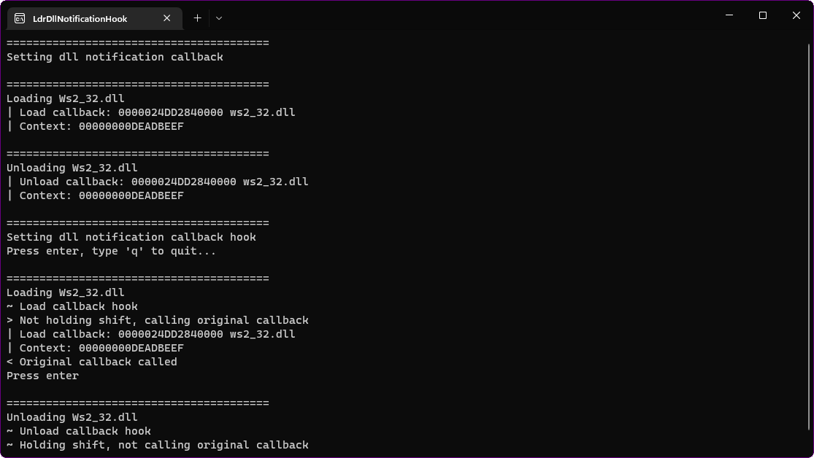

# LdrDllNotificationHook

This project demonstrates a way to hook all DLL load notifications in a process.
It hooks all callbacks which are registered with `LdrRegisterDllNotification`,
including callbacks which are registered after the hook is set.

The hook can be used to prevent the original callbacks from being called.



## Theory

The callbacks are stored in a doubly-linked list in ntdll,
`LdrpDllNotificationList`.

```
     LdrpDllNotificationList                                         Cookie
     │                                                               │
     ▼                                                               ▼
    ┌─────┐  ┌────────────────────┐  ┌────────────────────┐  ┌───┐  ┌────────────────────┐
┌──►│Flink├─►│Flink               ├─►│Flink               ├─►│   ├─►│Flink               ├───┐
│   ├─────┤  ├────────────────────┤  ├────────────────────┤  │...│  ├────────────────────┤   │
│ ┌─┤Blink│◄─┤Blink               │◄─┤Blink               │◄─┤   │◄─┤Blink               │◄┐ │
│ │ └─────┘  ├────────────────────┤  ├────────────────────┤  └───┘  ├────────────────────┤ │ │
│ │          │NotificationFunction│  │NotificationFunction│         │NotificationFunction│ │ │
│ │          ├────────────────────┤  ├────────────────────┤         ├────────────────────┤ │ │
│ │          │Context             │  │Context             │         │Context             │ │ │
│ │          └────────────────────┘  └────────────────────┘         └────────────────────┘ │ │
│ └────────────────────────────────────────────────────────────────────────────────────────┘ │
└────────────────────────────────────────────────────────────────────────────────────────────┘
```

`LdrpDllNotificationList` isn't exported, but it's easy to retrieve its address.
We can simply register a new callback with `LdrRegisterDllNotification`, which
returns a `Cookie` pointer which is in fact a pointer to the callback's entry in
the list. After adding the callback, its `Flink` pointer will point to the head
of the list.

**Note:** Relying on the `Flink` pointer is prone to races, since the list can
be modified by other threads. It's pretty unlikely to happen in practice,
though, since the function isn't called very often. To be 100% sure, you can
access the list from one of the callbacks, since ntdll acquires a lock while
iterating over the list and calling the registered callbacks. For example,
register a callback, load a DLL, and do the list access in that callback that
will be called due to the DLL load while the lock is acquired. That's not
implemented in this project.

After retrieving the address of the list head, we add a new entry to the
beginning of the list with a custom callback. When this callback is invoked, it
replaces the rest of the callbacks with a hook function. Since this entry will
always remain first, we assure that all callbacks are always hooked, even if
they are registered after the entry is added.

## References

* [ViewDllNotification x64dbg
  plugin](https://github.com/gmh5225/X64DBG-ViewDllNotification).
